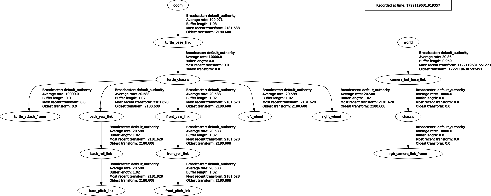
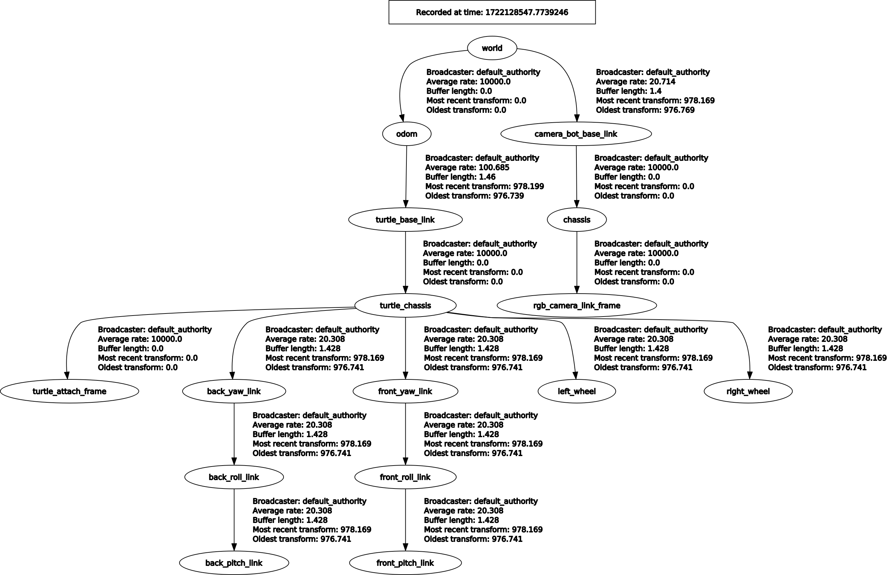
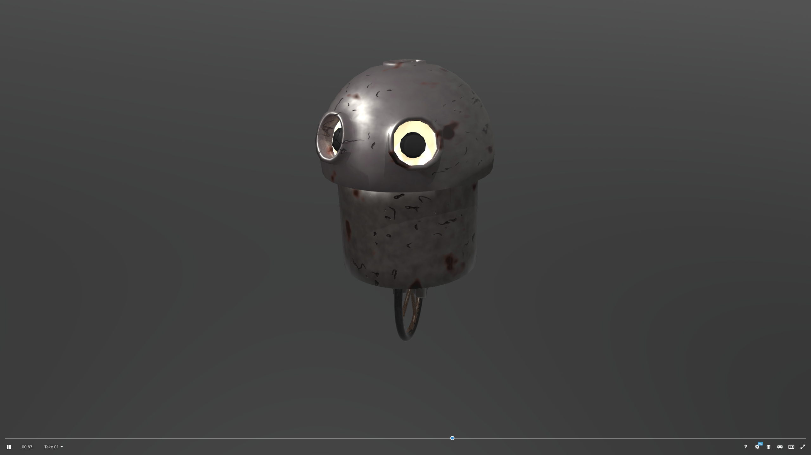
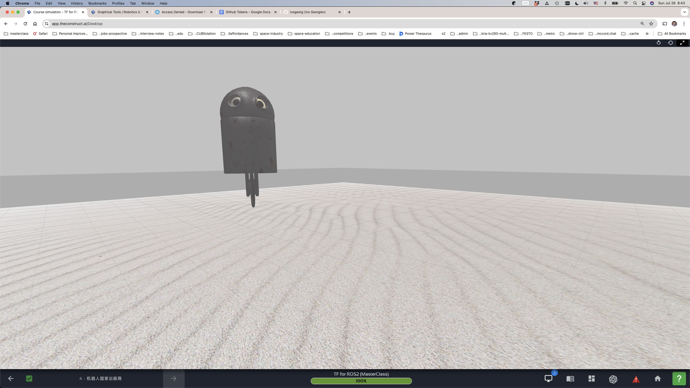
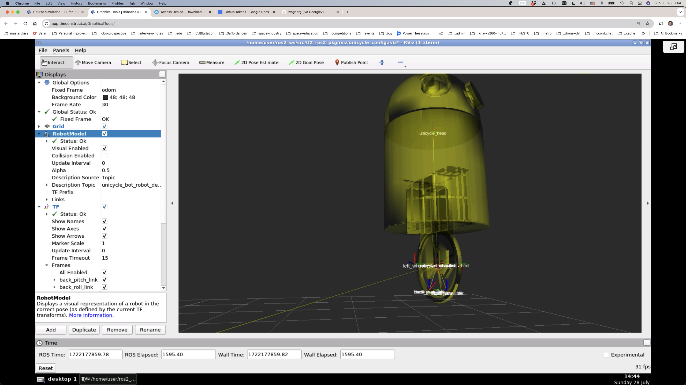
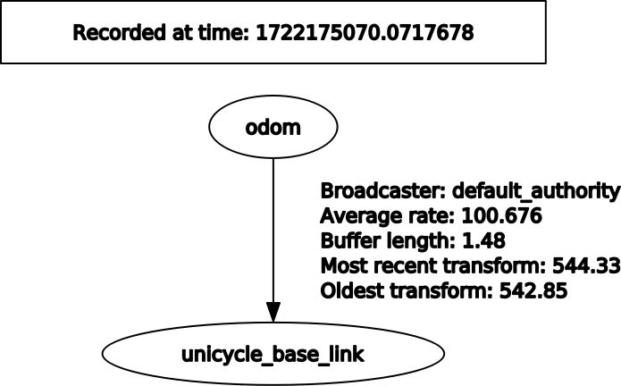
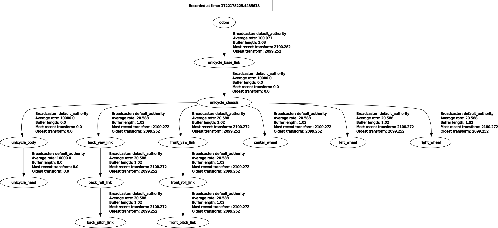

### tf2_ros2_pkg

#### Useful command-line tools

1. `ros2 run tf2_ros tf2_echo rgb_camera_link_frame turtle_chassis`  
2. `ros2 run rqt_tf_tree rqt_tf_tree`  
3. `ros2 run tf2_ros tf2_monitor camera_bot_base_link rgb_camera_link_frame`  
4. `ros2 run tf2_ros2_pkg static_broadcaster_front_turtle_frame.py turtle_chassis front_turtle_frame 0.4 0 0.4 0 0.7 3.1416`  
5. `ros2 topic pub /destination_frame std_msgs/msg/String "data: 'front_turtle_frame'"`  
6. `ros2 run teleop_twist_keyboard teleop_twist_keyboard --ros-args --remap cmd_vel:=/turtle_cmd_vel`

#### Cam Bot & Turtle

| Initial | After world2cam_bot_base_link | After world2odom |
| --- | --- | --- |
| |  |  |

#### Unicycle

| Mesh | Spawned | TF in Rviz2 |
| --- | --- | --- |
|  |  |  |

| Spawn w/o RSP | Spawn w/ RSP |
| --- | --- |
|  |  |

