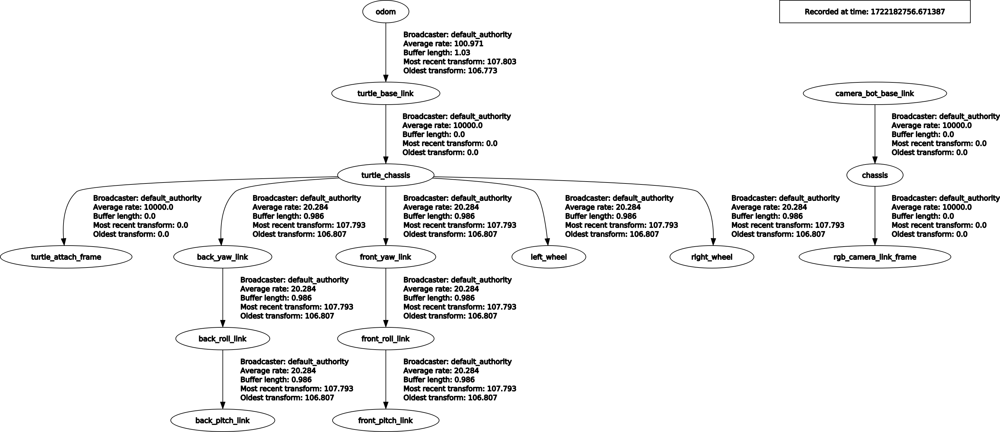

### tf2_ros2_pkg

#### Useful command-line tools

1. `ros2 run tf2_ros tf2_echo rgb_camera_link_frame turtle_chassis`
2. `ros2 run tf2_tools view_frames`  
3. `ros2 run rqt_tf_tree rqt_tf_tree`  
4. `ros2 run tf2_ros tf2_monitor camera_bot_base_link rgb_camera_link_frame`  
5. `ros2 run tf2_ros2_pkg static_broadcaster_front_turtle_frame.py turtle_chassis front_turtle_frame 0.4 0 0.4 0 0.7 3.1416`  
6. `ros2 topic pub /destination_frame std_msgs/msg/String "data: 'front_turtle_frame'"`  
7. `ros2 run teleop_twist_keyboard teleop_twist_keyboard --ros-args --remap cmd_vel:=/turtle_cmd_vel`

#### Cam Bot & Turtle

| Initial | After world2cam_bot_base_link | After world2odom |
| --- | --- | --- |
|  |  |  |

#### TF Listener

##### 1. Launching

Terminal 1:  
```
cd ~/ros2_ws
colcon build
source install/setup.bash
ros2 launch tf2_ros2_pkg start_tf_fixes.launch.xml
```  
Terminal 2:  
```
cd ~/ros2_ws
source install/setup.bash
rviz2 -d '~/ros2_ws/src/tf2_ros2_pkg/rviz/unit3_config.rviz'
```  
Terminal 3:
```
cd ~/ros2_ws
source install/setup.bash
ros2 run tf2_ros2_pkg static_broadcaster_front_turtle_frame.py turtle_chassis front_turtle_frame 0.4 0 0.4 0 0.7 3.1416
```  
_**Note:** Can Ctrl-C as this is a one-time publication of a static transform._  

##### 2. Examining the environment

Services:  
```
user:~/ros2_ws$ ros2 service list
/apply_joint_effort
/apply_link_wrench
/box_bot_joint_state/describe_parameters
/box_bot_joint_state/get_parameter_types
/box_bot_joint_state/get_parameters
/box_bot_joint_state/list_parameters
/box_bot_joint_state/set_parameters
/box_bot_joint_state/set_parameters_atomically
/cam_bot/gazebo_ros_state/describe_parameters
/cam_bot/gazebo_ros_state/get_parameter_types
/cam_bot/gazebo_ros_state/get_parameters
/cam_bot/gazebo_ros_state/list_parameters
/cam_bot/gazebo_ros_state/set_parameters
/cam_bot/gazebo_ros_state/set_parameters_atomically
/cam_bot/get_entity_state
/cam_bot/set_entity_state
/cam_bot_force_node/describe_parameters
/cam_bot_force_node/get_parameter_types
/cam_bot_force_node/get_parameters
/cam_bot_force_node/list_parameters
/cam_bot_force_node/set_parameters
/cam_bot_force_node/set_parameters_atomically
/cam_bot_robot_description_publisher/describe_parameters
/cam_bot_robot_description_publisher/get_parameter_types
/cam_bot_robot_description_publisher/get_parameters
/cam_bot_robot_description_publisher/list_parameters
/cam_bot_robot_description_publisher/set_parameters
/cam_bot_robot_description_publisher/set_parameters_atomically
/cam_bot_robot_state_publisher/describe_parameters
/cam_bot_robot_state_publisher/get_parameter_types
/cam_bot_robot_state_publisher/get_parameters
/cam_bot_robot_state_publisher/list_parameters
/cam_bot_robot_state_publisher/set_parameters
/cam_bot_robot_state_publisher/set_parameters_atomically
/camera_controller/describe_parameters
/camera_controller/get_parameter_types
/camera_controller/get_parameters
/camera_controller/list_parameters
/camera_controller/set_parameters
/camera_controller/set_parameters_atomically
/clear_joint_efforts
/clear_link_wrenches
/delete_entity
/differential_drive_controller/describe_parameters
/differential_drive_controller/get_parameter_types
/differential_drive_controller/get_parameters
/differential_drive_controller/list_parameters
/differential_drive_controller/set_parameters
/differential_drive_controller/set_parameters_atomically
/force_move_cam_bot_node/describe_parameters
/force_move_cam_bot_node/get_parameter_types
/force_move_cam_bot_node/get_parameters
/force_move_cam_bot_node/list_parameters
/force_move_cam_bot_node/set_parameters
/force_move_cam_bot_node/set_parameters_atomically
/gazebo/describe_parameters
/gazebo/get_parameter_types
/gazebo/get_parameters
/gazebo/list_parameters
/gazebo/set_parameters
/gazebo/set_parameters_atomically
/gazebo_ros_force/describe_parameters
/gazebo_ros_force/get_parameter_types
/gazebo_ros_force/get_parameters
/gazebo_ros_force/list_parameters
/gazebo_ros_force/set_parameters
/gazebo_ros_force/set_parameters_atomically
/gazebo_ros_p3d/describe_parameters
/gazebo_ros_p3d/get_parameter_types
/gazebo_ros_p3d/get_parameters
/gazebo_ros_p3d/list_parameters
/gazebo_ros_p3d/set_parameters
/gazebo_ros_p3d/set_parameters_atomically
/get_model_list
/odom_to_tf_broadcaster_node/describe_parameters
/odom_to_tf_broadcaster_node/get_parameter_types
/odom_to_tf_broadcaster_node/get_parameters
/odom_to_tf_broadcaster_node/list_parameters
/odom_to_tf_broadcaster_node/set_parameters
/odom_to_tf_broadcaster_node/set_parameters_atomically
/pause_physics
/reset_simulation
/reset_world
/rviz/describe_parameters
/rviz/get_parameter_types
/rviz/get_parameters
/rviz/list_parameters
/rviz/set_parameters
/rviz/set_parameters_atomically
/set_camera_info
/spawn_entity
/static_transform_publisher_turtle_odom/describe_parameters
/static_transform_publisher_turtle_odom/get_parameter_types
/static_transform_publisher_turtle_odom/get_parameters
/static_transform_publisher_turtle_odom/list_parameters
/static_transform_publisher_turtle_odom/set_parameters
/static_transform_publisher_turtle_odom/set_parameters_atomically
/turtle_robot_description_publisher/describe_parameters
/turtle_robot_description_publisher/get_parameter_types
/turtle_robot_description_publisher/get_parameters
/turtle_robot_description_publisher/list_parameters
/turtle_robot_description_publisher/set_parameters
/turtle_robot_description_publisher/set_parameters_atomically
/turtle_robot_state_publisher/describe_parameters
/turtle_robot_state_publisher/get_parameter_types
/turtle_robot_state_publisher/get_parameters
/turtle_robot_state_publisher/list_parameters
/turtle_robot_state_publisher/set_parameters
/turtle_robot_state_publisher/set_parameters_atomically
/unpause_physics

user:~/ros2_ws$ ros2 service list | grep entity_state
/cam_bot/get_entity_state
/cam_bot/set_entity_state

user:~/ros2_ws$ ros2 service type /cam_bot/set_entity_state
gazebo_msgs/srv/SetEntityState
```  

Intefaces:  
```
user:~/ros2_ws$ ros2 interface show gazebo_msgs/srv/SetEntityState
gazebo_msgs/EntityState state   # Entity state to set to.
        string name
                                    # An entity can be a model, link, collision, light, etc.
                                    # Be sure to use gazebo scoped naming notation (e.g. [model_name::link_name])
        geometry_msgs/Pose pose
                Point position
                        float64 x
                        float64 y
                        float64 z
                Quaternion orientation
                        float64 x 0
                        float64 y 0
                        float64 z 0
                        float64 w 1
        geometry_msgs/Twist twist
                Vector3  linear
                        float64 x
                        float64 y
                        float64 z
                Vector3  angular
                        float64 x
                        float64 y
                        float64 z
        string reference_frame
                                    # Leaving empty or "world" defaults to inertial world frame.
                                # Be sure to fill all fields, values of zero have meaning.
---
bool success                    # Return true if setting state was successful.

user:~/ros2_ws$ ros2 service type /cam_bot/get_entity_state
gazebo_msgs/srv/GetEntityState

user:~/ros2_ws$ ros2 interface show gazebo_msgs/srv/GetEntityState
string name                          # Entity's scoped name.
                                     # An entity can be a model, link, collision, light, etc.
                                     # Be sure to use gazebo scoped naming notation (e.g. [model_name::link_name])
string reference_frame               # Return pose and twist relative to this entity.
                                     # Leaving empty or "world" will use inertial world frame.
---
std_msgs/Header header               # Standard metadata for higher-level stamped data types.
        builtin_interfaces/Time stamp
                int32 sec
                uint32 nanosec
        string frame_id
                                     # * header.stamp Timestamp related to the pose.
                                     # * header.frame_id Filled with the relative_frame.
gazebo_msgs/EntityState state        # Contains pose and twist.
        string name
                                    # An entity can be a model, link, collision, light, etc.
                                    # Be sure to use gazebo scoped naming notation (e.g. [model_name::link_name])
        geometry_msgs/Pose pose
                Point position
                        float64 x
                        float64 y
                        float64 z
                Quaternion orientation
                        float64 x 0
                        float64 y 0
                        float64 z 0
                        float64 w 1
        geometry_msgs/Twist twist
                Vector3  linear
                        float64 x
                        float64 y
                        float64 z
                Vector3  angular
                        float64 x
                        float64 y
                        float64 z
        string reference_frame
                                    # Leaving empty or "world" defaults to inertial world frame.
bool success                         # Return true if get was successful. If false, the state contains garbage.
```  

Nodes:  
```
user:~/ros2_ws$ ros2 node list
/box_bot_joint_state
/cam_bot/gazebo_ros_state
/cam_bot_force_node
/cam_bot_robot_description_publisher
/cam_bot_robot_state_publisher
/camera_controller
/differential_drive_controller
/force_move_cam_bot_node
/gazebo
/gazebo_ros_force
/gazebo_ros_p3d
/odom_to_tf_broadcaster_node
/rviz
/static_transform_publisher_turtle_odom
/transform_listener_impl_55769f9a66d0
/turtle_robot_description_publisher
/turtle_robot_state_publisher

user:~/ros2_ws$ ros2 node info /cam_bot/gazebo_ros_state
/cam_bot/gazebo_ros_state
  Subscribers:
    /clock: rosgraph_msgs/msg/Clock
    /parameter_events: rcl_interfaces/msg/ParameterEvent
  Publishers:
    /cam_bot/link_states: gazebo_msgs/msg/LinkStates
    /cam_bot/model_states_demo: gazebo_msgs/msg/ModelStates
    /parameter_events: rcl_interfaces/msg/ParameterEvent
    /rosout: rcl_interfaces/msg/Log
  Service Servers:
    /cam_bot/gazebo_ros_state/describe_parameters: rcl_interfaces/srv/DescribeParameters
    /cam_bot/gazebo_ros_state/get_parameter_types: rcl_interfaces/srv/GetParameterTypes
    /cam_bot/gazebo_ros_state/get_parameters: rcl_interfaces/srv/GetParameters
    /cam_bot/gazebo_ros_state/list_parameters: rcl_interfaces/srv/ListParameters
    /cam_bot/gazebo_ros_state/set_parameters: rcl_interfaces/srv/SetParameters
    /cam_bot/gazebo_ros_state/set_parameters_atomically: rcl_interfaces/srv/SetParametersAtomically
    /cam_bot/get_entity_state: gazebo_msgs/srv/GetEntityState
    /cam_bot/set_entity_state: gazebo_msgs/srv/SetEntityState
  Service Clients:

  Action Servers:

  Action Clients:

user:~/ros2_ws$ ros2 node info /gazebo_ros_force
/gazebo_ros_force
  Subscribers:
    /cam_bot_force: geometry_msgs/msg/Wrench
    /clock: rosgraph_msgs/msg/Clock
    /parameter_events: rcl_interfaces/msg/ParameterEvent
  Publishers:
    /parameter_events: rcl_interfaces/msg/ParameterEvent
    /rosout: rcl_interfaces/msg/Log
  Service Servers:
    /gazebo_ros_force/describe_parameters: rcl_interfaces/srv/DescribeParameters
    /gazebo_ros_force/get_parameter_types: rcl_interfaces/srv/GetParameterTypes
    /gazebo_ros_force/get_parameters: rcl_interfaces/srv/GetParameters
    /gazebo_ros_force/list_parameters: rcl_interfaces/srv/ListParameters
    /gazebo_ros_force/set_parameters: rcl_interfaces/srv/SetParameters
    /gazebo_ros_force/set_parameters_atomically: rcl_interfaces/srv/SetParametersAtomically
  Service Clients:

  Action Servers:

  Action Clients:

user:~/ros2_ws$ ros2 node info /gazebo_ros_p3d
/gazebo_ros_p3d
  Subscribers:
    /clock: rosgraph_msgs/msg/Clock
    /parameter_events: rcl_interfaces/msg/ParameterEvent
  Publishers:
    /cam_bot_odom: nav_msgs/msg/Odometry
    /parameter_events: rcl_interfaces/msg/ParameterEvent
    /rosout: rcl_interfaces/msg/Log
  Service Servers:
    /gazebo_ros_p3d/describe_parameters: rcl_interfaces/srv/DescribeParameters
    /gazebo_ros_p3d/get_parameter_types: rcl_interfaces/srv/GetParameterTypes
    /gazebo_ros_p3d/get_parameters: rcl_interfaces/srv/GetParameters
    /gazebo_ros_p3d/list_parameters: rcl_interfaces/srv/ListParameters
    /gazebo_ros_p3d/set_parameters: rcl_interfaces/srv/SetParameters
    /gazebo_ros_p3d/set_parameters_atomically: rcl_interfaces/srv/SetParametersAtomically
  Service Clients:

  Action Servers:

  Action Clients:

user:~/ros2_ws$ ros2 node info /odom_to_tf_broadcaster_node
/odom_to_tf_broadcaster_node
  Subscribers:
    /cam_bot_odom: nav_msgs/msg/Odometry
  Publishers:
    /parameter_events: rcl_interfaces/msg/ParameterEvent
    /rosout: rcl_interfaces/msg/Log
    /tf: tf2_msgs/msg/TFMessage
  Service Servers:
    /odom_to_tf_broadcaster_node/describe_parameters: rcl_interfaces/srv/DescribeParameters
    /odom_to_tf_broadcaster_node/get_parameter_types: rcl_interfaces/srv/GetParameterTypes
    /odom_to_tf_broadcaster_node/get_parameters: rcl_interfaces/srv/GetParameters
    /odom_to_tf_broadcaster_node/list_parameters: rcl_interfaces/srv/ListParameters
    /odom_to_tf_broadcaster_node/set_parameters: rcl_interfaces/srv/SetParameters
    /odom_to_tf_broadcaster_node/set_parameters_atomically: rcl_interfaces/srv/SetParametersAtomically
  Service Clients:

  Action Servers:

  Action Clients:

user:~/ros2_ws$ ros2 node info /static_transform_publisher_turtle_odom
/static_transform_publisher_turtle_odom
  Subscribers:
    /parameter_events: rcl_interfaces/msg/ParameterEvent
  Publishers:
    /parameter_events: rcl_interfaces/msg/ParameterEvent
    /rosout: rcl_interfaces/msg/Log
    /tf_static: tf2_msgs/msg/TFMessage
  Service Servers:
    /static_transform_publisher_turtle_odom/describe_parameters: rcl_interfaces/srv/DescribeParameters
    /static_transform_publisher_turtle_odom/get_parameter_types: rcl_interfaces/srv/GetParameterTypes
    /static_transform_publisher_turtle_odom/get_parameters: rcl_interfaces/srv/GetParameters
    /static_transform_publisher_turtle_odom/list_parameters: rcl_interfaces/srv/ListParameters
    /static_transform_publisher_turtle_odom/set_parameters: rcl_interfaces/srv/SetParameters
    /static_transform_publisher_turtle_odom/set_parameters_atomically: rcl_interfaces/srv/SetParametersAtomically
  Service Clients:

  Action Servers:

  Action Clients:

```  

Topics:  
```
user:~/ros2_ws$ ros2 topic list
/cam_bot/link_states
/cam_bot/model_states_demo
/cam_bot_cmd_vel
/cam_bot_force
/cam_bot_odom
/cam_bot_robot_description
/camera/camera_info
/camera/image_raw
/clicked_point
/clock
/destination_frame
/goal_pose
/initialpose
/joint_states
/parameter_events
/performance_metrics
/robot_description
/rosout
/tf
/tf_static
/turtle_cmd_vel
/turtle_odom
/turtle_robot_description
user:~/ros2_ws$
```  
```
user:~/ros2_ws$ ros2 topic info /cam_bot_force -v
Type: geometry_msgs/msg/Wrench

Publisher count: 1

Node name: cam_bot_force_node
Node namespace: /
Topic type: geometry_msgs/msg/Wrench
Endpoint type: PUBLISHER
GID: 1a.dc.10.01.7e.7b.e5.c1.ed.5e.9d.fb.00.00.15.03.00.00.00.00.00.00.00.00
QoS profile:
  Reliability: RELIABLE
  Durability: VOLATILE
  Lifespan: 9223372036854775807 nanoseconds
  Deadline: 9223372036854775807 nanoseconds
  Liveliness: AUTOMATIC
  Liveliness lease duration: 9223372036854775807 nanoseconds

Subscription count: 1

Node name: gazebo_ros_force
Node namespace: /
Topic type: geometry_msgs/msg/Wrench
Endpoint type: SUBSCRIPTION
GID: 04.81.10.01.26.b4.aa.cd.06.73.7c.09.00.00.8b.04.00.00.00.00.00.00.00.00
QoS profile:
  Reliability: RELIABLE
  Durability: VOLATILE
  Lifespan: 9223372036854775807 nanoseconds
  Deadline: 9223372036854775807 nanoseconds
  Liveliness: AUTOMATIC
  Liveliness lease duration: 9223372036854775807 nanoseconds

user:~/ros2_ws$ ros2 topic info /cam_bot/model_states_demo -v
Type: gazebo_msgs/msg/ModelStates

Publisher count: 1

Node name: gazebo_ros_state
Node namespace: /cam_bot
Topic type: gazebo_msgs/msg/ModelStates
Endpoint type: PUBLISHER
GID: 04.81.10.01.26.b4.aa.cd.06.73.7c.09.00.00.42.03.00.00.00.00.00.00.00.00
QoS profile:
  Reliability: RELIABLE
  Durability: VOLATILE
  Lifespan: 9223372036854775807 nanoseconds
  Deadline: 9223372036854775807 nanoseconds
  Liveliness: AUTOMATIC
  Liveliness lease duration: 9223372036854775807 nanoseconds

Subscription count: 0

user:~/ros2_ws$ ros2 topic info /cam_bot/link_states -v
Type: gazebo_msgs/msg/LinkStates

Publisher count: 1

Node name: gazebo_ros_state
Node namespace: /cam_bot
Topic type: gazebo_msgs/msg/LinkStates
Endpoint type: PUBLISHER
GID: 04.81.10.01.26.b4.aa.cd.06.73.7c.09.00.00.43.03.00.00.00.00.00.00.00.00
QoS profile:
  Reliability: RELIABLE
  Durability: VOLATILE
  Lifespan: 9223372036854775807 nanoseconds
  Deadline: 9223372036854775807 nanoseconds
  Liveliness: AUTOMATIC
  Liveliness lease duration: 9223372036854775807 nanoseconds

Subscription count: 0

user:~/ros2_ws$ ros2 topic info /destination_frame -v
Type: std_msgs/msg/String

Publisher count: 0

Subscription count: 1

Node name: force_move_cam_bot_node
Node namespace: /
Topic type: std_msgs/msg/String
Endpoint type: SUBSCRIPTION
GID: 29.26.10.01.c4.7d.05.d4.70.fb.a7.91.00.00.16.04.00.00.00.00.00.00.00.00
QoS profile:
  Reliability: RELIABLE
  Durability: VOLATILE
  Lifespan: 9223372036854775807 nanoseconds
  Deadline: 9223372036854775807 nanoseconds
  Liveliness: AUTOMATIC
  Liveliness lease duration: 9223372036854775807 nanoseconds
```

#### Unicycle

| Mesh | Spawned | TF in Rviz2 |
| --- | --- | --- |
|  |  |  |

| Spawn w/o RSP | Spawn w/ RSP |
| --- | --- |
|  |  |


